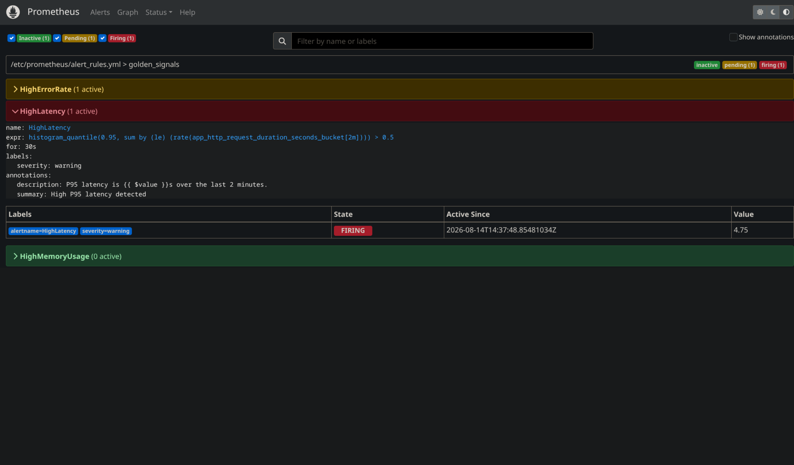
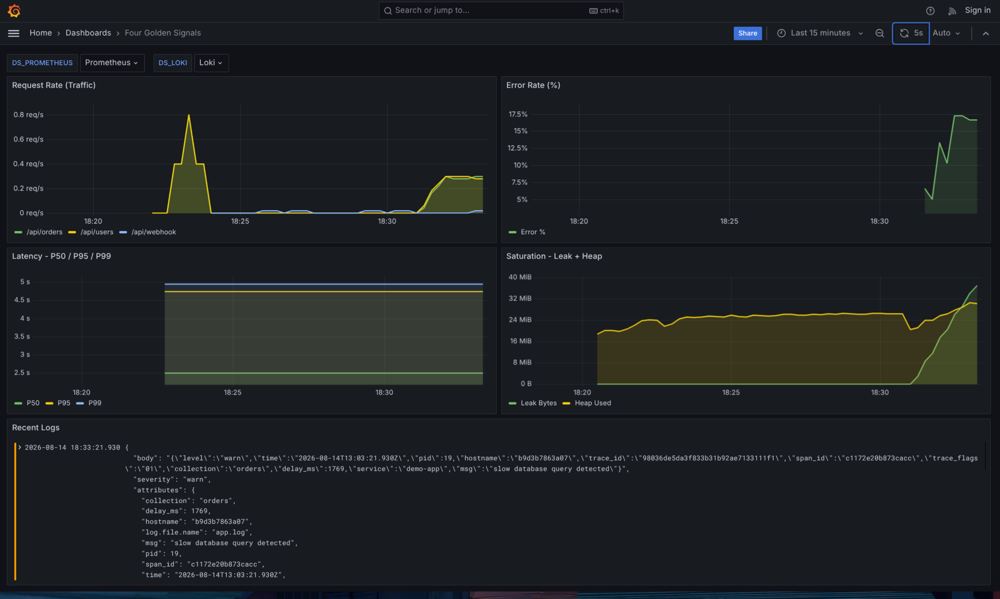
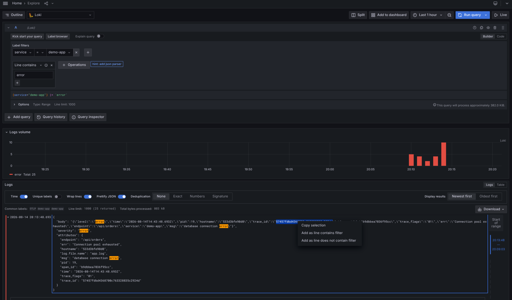
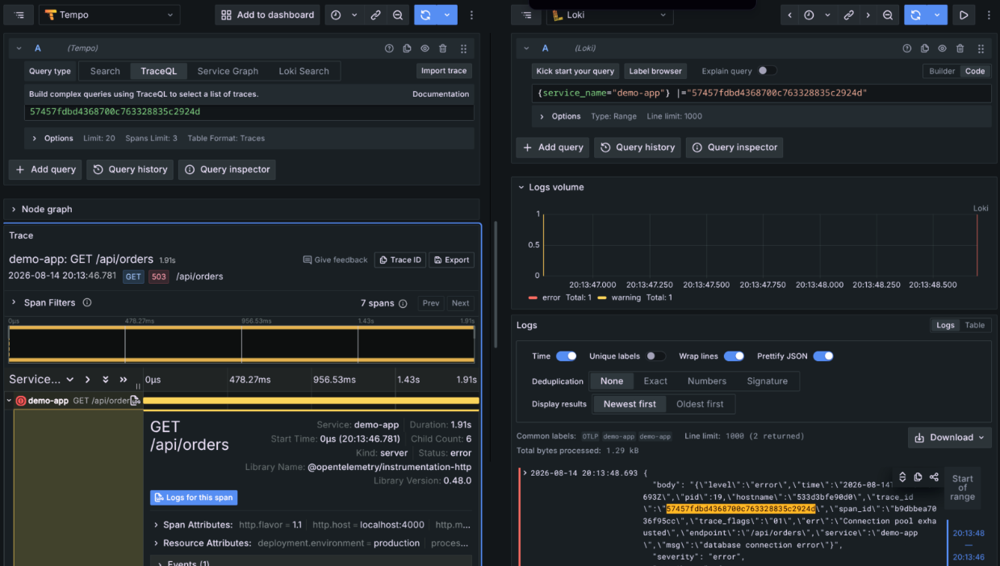

<div align="center">

# 🔭 Cloud-Native Observability & Incident Response Platform

**End-to-end metrics, logs, traces, dashboards, alerting, and incident investigation — built and battle-tested against a real simulated production incident.**


[Overview](#-overview) • [Architecture](#️-architecture) • [Live Incident Walkthrough](#-live-incident-walkthrough) • [Running It](#️-running-the-project) • [Key Lessons](#-key-lessons)

</div>

---


## 📌 Overview

Modern applications don't fail with a simple **"server is down"** message. A production incident shows up as elevated latency, a rising error rate, a memory leak, or a struggling dependency — and finding the *actual* root cause takes more than one dashboard.

This project is an **end-to-end observability platform** that collects and correlates the three pillars of telemetry:

> **Metrics + Logs + Traces**

It uses **OpenTelemetry** as the instrumentation and transport layer, and wires **Prometheus, Loki, Tempo, Grafana, and Alertmanager** into a single incident-response workflow. To prove the pipeline actually works — not just looks good — the app is stress-tested with an injected database-latency and memory-leak fault, and the resulting telemetry is used to detect, investigate, pinpoint, fix, and verify the incident end to end.

---

## 🏗️ Architecture

```text
                         ┌─────────────────────────┐
                         │     Node.js / Express   │
                         │       Application       │
                         └────────────┬────────────┘
                                      │
                              OpenTelemetry (OTLP)
                                      │
                                      ▼
                    ┌────────────────────────────────┐
                    │    OpenTelemetry Collector     │
                    │   Receivers → Processors →     │
                    │            Exporters            │
                    └───────────────┬────────────────┘
                                    │
                   ┌────────────────┼────────────────┐
                   ▼                ▼                ▼
             ┌───────────┐    ┌───────────┐    ┌───────────┐
             │Prometheus │    │   Loki    │    │   Tempo   │
             │  Metrics  │    │   Logs    │    │  Traces   │
             └─────┬─────┘    └─────┬─────┘    └─────┬─────┘
                   └────────────────┼────────────────┘
                                    ▼
                              ┌────────────┐
                              │  Grafana   │
                              │ Dashboards │
                              │ Correlation│
                              └─────┬──────┘
                                    ▼
                             ┌──────────────┐
                             │ Alertmanager │
                             │ Alert Routing│
                             └──────────────┘
```

---

## 🧩 Technology Stack

| Technology | Purpose |
|---|---|
| **Node.js / Express** | Demo application and telemetry source |
| **OpenTelemetry** | Application instrumentation and telemetry collection |
| **OTLP** | Telemetry transport protocol |
| **OpenTelemetry Collector** | Receives, processes, and exports telemetry |
| **Prometheus** | Metrics storage and PromQL querying |
| **Loki** | Centralized log aggregation and LogQL querying |
| **Tempo** | Distributed trace storage |
| **Grafana** | Unified dashboards + cross-signal correlation |
| **Alertmanager** | Alert routing and lifecycle (firing → resolved) |
| **Docker / Docker Compose** | Containerized deployment and orchestration |

---

## 🔥 Why This Project?

Traditional monitoring answers: **"Is something wrong?"**
Observability answers: **"What's wrong, where, why, and how do I know it's fixed?"**

This project doesn't stop at building dashboards — it proves the pipeline by running a real incident through it, end to end:

```text
Detect  →  Investigate  →  Pinpoint  →  Fix  →  Verify
```

---

## 📊 The Three Pillars

| Pillar | Answers | Backend |
|---|---|---|
| 📈 **Metrics** | *What* is happening? (rate, errors, duration, saturation) | Prometheus |
| 📝 **Logs** | *What happened*, in detail? | Loki |
| 🔍 **Traces** | *Where* did the request spend its time or fail? | Tempo |

The value isn't collecting three signals in isolation — it's **correlating** them: a metric tells you something's wrong, a trace ID in the logs tells you which request, and the trace itself shows you the exact slow span.

---

## 🎬 Live Incident Walkthrough

To validate the stack, I injected a fault into the demo app — `SIMULATE_DB_LATENCY=true` (every DB query takes 800–2000ms and 30% of `/api/orders` calls return 503) plus `SIMULATE_MEMORY_LEAK=true` (each `/api/users` call leaks 1MB) — then generated sustained load and walked the incident through all three signals.

### 1️⃣ Detect — Prometheus fires an alert

The `HighLatency` rule (`P95 > 0.5s` for 30s) transitions to **FIRING**, alongside `HighErrorRate`.



### 2️⃣ Confirm — Grafana's Golden Signals dashboard turns red

Traffic, error rate, latency, and memory saturation all move at once — error rate climbs past 15%, P95/P99 latency spike to 4–5s, and heap usage climbs steadily from the leak.



### 3️⃣ Investigate — Loki narrows it down with LogQL

Filtering `{service="demo-app"} |= "error"` surfaces the dominant failure pattern — `Connection pool exhausted` — and, critically, a `trace_id` embedded in every structured log line.



### 4️⃣ Pinpoint — Tempo shows the exact trace behind the log line

Following that `trace_id` into Tempo reveals the full request waterfall: a `GET /api/orders` span running **1.91s** and returning `503`, with the slow `db.query` span as the clear bottleneck — logs and traces correlated side by side.



### 5️⃣ Fix & Verify

Removing the fault flags and restarting the app, then replaying clean traffic, drives error rate back to 0%, latency back under 50ms, and the alert transitions from `firing` → `resolved` in Alertmanager.

**The full loop, proven with real telemetry:**

```text
Alert fires (Prometheus) → Dashboard confirms (Grafana) → Pattern found (Loki)
        → Root cause pinpointed (Tempo) → Fixed → Verified recovered
```

---

## 🚨 Alerting

| Alert | Condition | Severity |
|---|---|---|
| `HighErrorRate` | 5xx rate elevated over a rolling window | warning |
| `HighLatency` | `histogram_quantile(0.95, ...) > 0.5s` for 30s | warning |
| `HighMemoryUsage` | Heap/leak growth trending upward | warning |

Alerts route through Alertmanager and auto-resolve once the underlying condition clears for the configured `for` duration — no manual dismissal needed.

---

## 🛠️ Running the Project

### Prerequisites

```bash
docker --version
docker compose version
git --version
```

### Clone & Start

```bash
git clone https://github.com/Preetam-3/cloud-native-observability-platform.git
cd cloud-native-observability-platform

docker compose up -d
docker compose ps        # verify all services are healthy
docker compose logs -f   # tail logs
```

### Access the Stack

| Service | URL |
|---|---|
| Grafana | http://localhost:3001 |
| Prometheus | http://localhost:9090 |
| Alertmanager | http://localhost:9093 |
| Loki (via Grafana Explore) | http://localhost:3100 |
| Tempo (via Grafana Explore) | http://localhost:3200 |
| Demo app | http://localhost:4000 |

### Reproduce the Incident

```bash
# 1. Inject the fault
SIMULATE_DB_LATENCY=true SIMULATE_MEMORY_LEAK=true docker compose up -d demo-app

# 2. Generate load
for i in $(seq 1 100); do
  curl -s http://localhost:4000/api/users  > /dev/null
  curl -s http://localhost:4000/api/orders > /dev/null
  sleep 0.5
done

# 3. Watch Alertmanager / Grafana, then investigate via Loki → Tempo

# 4. Fix and verify
docker compose stop demo-app
docker compose up -d demo-app
```

### Stop & Clean Up

```bash
docker compose down -v
```

---

## 🔍 Troubleshooting Approach

1. **Check service state** — `docker compose ps`
2. **Inspect service logs** — `docker compose logs <service>`
3. **Verify connectivity** — can the service reach its backend?
4. **Validate telemetry** — is data actually arriving?
5. **Check Grafana** — dashboards + Explore
6. **Correlate** — Metrics → Traces → Logs
7. **Identify root cause** — app code, dependency, config, or resources
8. **Verify recovery** — signals return to baseline

---

## 📁 Repository Structure

```text
cloud-native-observability-platform/
├── app/                          # Node.js/Express demo app + OTel instrumentation
├── otel/
│   └── otel-collector-config.yml
├── prometheus/
│   ├── prometheus.yml
│   └── rules/
├── loki/
│   └── loki-config.yml
├── tempo/
│   └── tempo.yml
├── grafana/
│   ├── dashboards/
│   └── provisioning/
├── alertmanager/
│   └── alertmanager.yml
├── screenshots/                  # incident walkthrough images used in this README
├── docker-compose.yml
└── README.md
```

---

## 🧠 Key Engineering Concepts Demonstrated

Observability architecture · OpenTelemetry instrumentation & OTLP · Collector pipelines · Prometheus & PromQL · Centralized logging & LogQL · Distributed tracing · Grafana dashboards & correlation · Alerting lifecycles · Root-cause analysis · Docker networking · Production-style incident troubleshooting

---

## 💡 Key Lessons

**Monitoring ≠ Observability.** Monitoring tells you a known condition occurred. Observability gives you enough context to investigate *unknown* failure modes.

**More dashboards ≠ better observability.** A panel only earns its place if it helps someone make a decision.

**Each signal answers a different question:**
```text
Metrics → What is happening?
Logs    → What happened?
Traces  → Where did it happen?
```

**Alerts should be actionable**, not noise — every alert here maps to a condition worth waking someone up for.

---

## 📈 Future Improvements

- [ ] SLO-based alerting with error budgets
- [ ] Alertmanager routing to Slack / PagerDuty
- [ ] Sampling strategy for high-traffic services
- [ ] Log retention policies
- [ ] Kubernetes deployment via Helm
- [ ] Synthetic monitoring / health probes
- [ ] CI/CD pipeline for the stack itself

---

## 📚 References

- [OpenTelemetry](https://opentelemetry.io/)
- [Prometheus](https://prometheus.io/)
- [Grafana](https://grafana.com/)
- [Grafana Loki](https://grafana.com/oss/loki/)
- [Grafana Tempo](https://grafana.com/oss/tempo/)

---

<div align="center">

## 👤 Author

**Preetam Kumar Badatya**
DevOps • Cloud • DevSecOps • SRE

### 🔭 Observe → 🚨 Detect → 🔍 Investigate → 🛠️ Fix → ✅ Verify

**Building systems that don't just tell you something is broken — they help you understand why.**

</div>
